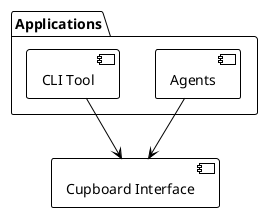

# Documentation Standards

## Writing Style

Write in the style inspired by The Elements of Style by Strunk and White:

- Be concise and eliminate unnecessary words
- Use active voice with strong verbs
- Prefer specific, concrete language
- Avoid qualifiers and jargon unless explained
- Vary sentence structure (avoid equal-length sentences)

Use the royal "we" in active voice:

- ✅ GOOD: "We implement the feature..."
- ❌ BAD: "This document describes..." or "The architecture implements..."

## Forbidden Terms

DO NOT use these overused or imprecise terms:

- "critical", "critically", "key", "deliberate", "strategic"
- "precisely", "absolutely", "fundamental", "breakthrough"
- "principled", "honest", "at the heart of", "grounded"
- "standards-aligned" (unless absolutely necessary)

## Formatting Rules

### Paragraphs and Structure

- Use paragraph form unless not possible
- Vary sentence length to maintain readability
- Use short paragraphs only to emphasize a point
- DO NOT use bold text or horizontal rules

### Lists and Tables

- Use tables instead of lists for short entries
- Name all tables
- DO NOT use colons except to introduce lists

### Abbreviations

- Explain abbreviations at least once per document section
- Define domain-specific abbreviations on first use

### AI Terminology

- Use "Generative AI" (not "GenAI" or "Generative Artificial Intelligence")
- Use "narrow-AI" (hyphenated) for traditional ML approaches
- Use "general-AI" (hyphenated) for advanced AI systems
- Be precise: avoid using AI and Generative AI interchangeably

## Figures and Diagrams

All diagrams MUST be written in PlantUML and defined inline in the markdown file using fenced code blocks. Do not create separate `.puml` files or generate PNG images.

### Inline PlantUML Format

Use a fenced code block with the `plantuml` language tag, wrapped in a centered table for captioning:

```markdown
|  |
|:--:|
| ```plantuml |
| @startuml |
| ... diagram source ... |
| @enduml |
| ``` |
|Figure N Title of the Figure |
```

**Example:**

````markdown
|  |
|:--:|



|Figure 1 System Context |
````

### Figure Rules

- Define the diagram inline using `` ```plantuml `` fenced code blocks
- Place the code block between the `|:--:|` alignment row and the caption row
- Caption format: `|Figure N Description |` (no colon after "Figure N")
- Number figures sequentially within each document

## Citations and References

- Cite prior works with proper attribution
- Ensure citations are accurate and traceable
- Consider publication dates when evaluating terminology
- DO NOT plagiarize - rephrase content with proper citations
- Use quotation marks sparingly for direct quotes
- Provide evidence for all claims

## Quotation Marks Usage

DO use quotation marks to:
- Discuss a word, phrase, or letter without using its intended meaning
- Draw attention to specific terminology or concepts

DO NOT use quotation marks to:
- Copy and paste phrases that can be reworded
- Overuse direct quotations (use sparingly for very important content)

## Content Quality

- Ensure factual correctness traceable to source material
- Avoid exaggeration and unsupported claims
- DO NOT use jargon without explanation
- Be specific and precise (avoid ambiguous language)
- Stay focused on main topic (no unnecessary tangents)
- Be aware of design-stage concepts (avoid definitive statements)

## Style to Avoid

DO NOT use AI-recognizable patterns:
- Avoid excessive parallelism and repetitive phrasing
- Avoid overuse of dashes
- Avoid awkward constructions like "architectural construction"
- DO NOT use very short paragraphs unless emphasizing
