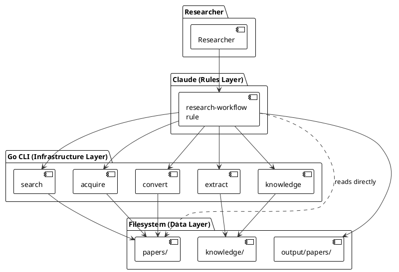
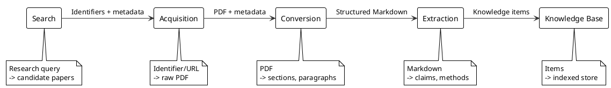

<!-- Copyright Mesh Intelligence Inc., 2026. All rights reserved. -->

# Research Engine Architecture

## System Overview

We build a two-layer system for academic research. The bottom layer is a Go CLI that provides infrastructure: searching academic APIs, downloading PDFs, converting them to structured Markdown, extracting typed knowledge items, and indexing them in a local database. The top layer is Claude, operating as the researcher's partner. Claude searches for papers, reads them, queries the knowledge base, and writes new work grounded in what it has read. A single rule file (`.claude/rules/research-workflow.md`) describes all available CLI commands, file conventions, and configuration so Claude can act on any research request.

The core insight is that Claude can read, understand, and write, but it needs papers in a format it can process and a knowledge base to retrieve specific items across many papers. We convert PDFs to Markdown so Claude can read them. We extract knowledge items with provenance so Claude can find and cite specific claims without re-reading entire papers. The Go infrastructure handles the mechanical work; Claude handles the judgment.

### Two-Layer Architecture

|  |
|:--:|



|Figure 1 Two-layer architecture showing Claude with research-workflow rule, Go CLI infrastructure, and filesystem |

### Pipeline Lifecycle

A paper moves through five infrastructure states, one per pipeline stage:

1. Searched: the paper appears as a candidate result from an academic API query.
2. Acquired: the raw PDF exists on disk with metadata (source URL, DOI, title).
3. Converted: the PDF has been transformed into structured Markdown with section boundaries.
4. Extracted: knowledge items have been pulled from the structured text and linked to their source sections.
5. Stored: knowledge items reside in the knowledge base, indexed for retrieval.

Paper writing is handled by Claude, not by a Go pipeline stage. Claude reads papers directly (via converted Markdown), queries the knowledge base, and writes sections with inline citations.

Each state is visible as files on disk. A paper's progress through the pipeline is determined by which artifacts exist in the project directory. The research-workflow rule documents this state model so Claude can determine what actions are available for each paper. PRDs define the detailed state transitions and error conditions for each stage.

### Data Flow

Data flows forward through the infrastructure pipeline. Each stage consumes the output of the previous stage and produces input for the next. The stages share no in-memory state; all communication happens through files on disk. Claude reads these files directly.

|  |
|:--:|



|Figure 2 Infrastructure pipeline data flow from search through knowledge base |

## Pipeline Interface

The pipeline operates on three data structures that flow between infrastructure stages. We describe them here at the architecture level; PRDs specify the full field definitions and validation rules.

### Data Structures

Table 1 Pipeline Data Structures

| Structure | Role | Produced By | Consumed By |
|-----------|------|-------------|-------------|
| SearchResult | A candidate paper from an academic API query (identifier, title, authors, abstract, source, relevance score) | Search | Acquisition (as input identifiers) |
| Paper | Metadata and file paths for an acquired paper (URL, DOI, title, authors, PDF path) | Acquisition | Conversion, Extraction |
| KnowledgeItem | A typed extraction from a paper (claim, method, definition) with provenance (paper ID, section, page) | Extraction | Knowledge Base, Claude |

### Operations per Stage

Table 2 Pipeline Operations

| Stage | Operation | Input | Output | Description |
|-------|-----------|-------|--------|-------------|
| Search | Search | Research query (free-text or structured) | List of SearchResults | Queries academic APIs, deduplicates, and ranks candidate papers |
| Acquisition | Acquire | URL, DOI, or file path | Paper record + PDF on disk | Downloads or copies the PDF and creates metadata |
| Conversion | Convert | Paper record | Structured Markdown file | Transforms PDF into sections, paragraphs, and figure references |
| Extraction | Extract | Structured Markdown | List of KnowledgeItems | Identifies claims, methods, and definitions with provenance |
| Knowledge Base | Store | KnowledgeItems | Indexed knowledge base | Persists items and builds retrieval index |
| Knowledge Base | Retrieve | Query string | Ranked KnowledgeItems | Returns items relevant to the query |

Each operation is a Cobra subcommand under `research-engine`. PRDs define the full signatures, preconditions, postconditions, and error handling for each operation.

## Claude Research Workflow

Claude drives the research workflow through a single rule file at `.claude/rules/research-workflow.md`. The rule describes what CLI commands exist, what flags they accept, where files live, and what conventions to follow. Claude reads this rule automatically and infers the right actions from the researcher's natural-language requests. The researcher talks to Claude; Claude decides which commands to run and which files to read.

Table 3 Research Capabilities

| Capability | What Claude Does | Infrastructure Used |
|------------|------------------|---------------------|
| Search | Formulates queries, invokes the search CLI, interprets and ranks results | `research-engine search` |
| Acquire | Downloads papers, converts to Markdown, optionally extracts knowledge | `research-engine acquire`, `convert`, `extract` |
| Read | Reads converted Markdown papers directly, summarizes, discusses | Reads files directly (no CLI) |
| Query | Searches the knowledge base, traces items to sources, identifies themes | `research-engine knowledge retrieve` |
| Write | Creates paper projects, writes sections with inline citations | `research-engine knowledge retrieve`, reads papers directly |

The rule replaces five prescriptive skill scripts with a declarative capability map. Instead of step-by-step scripts that tell Claude what to do, the rule describes what tools exist and what conventions to maintain. Claude decides the workflow based on user intent. See prd009-research-workflow for the requirements that govern this rule.

## System Components

### Search

We query academic and patent APIs to find papers and patents relevant to a research question. The search component accepts free-text queries or structured parameters (author, keywords, date range), fans them out to multiple backends (arXiv API, Semantic Scholar API, OpenAlex API, PatentsView API), deduplicates results across sources, and returns a ranked list of candidate papers and patents. Each result carries an identifier that the acquisition stage can consume directly, along with title, authors, abstract, and a relevance score. The backend interface is extensible so we can add sources without modifying existing backend code. Patent results use US patent numbers as identifiers (e.g. US7654321) and participate in the same deduplication and ranking pipeline as academic results, with kind-code normalization to prevent duplicate patents.

See PRD: Paper Search for query interface, backend requirements, deduplication rules, and output format. See PRD: Patent Search for PatentsView query translation, result mapping, and rate limiting.

### Acquisition

We download papers and patents from URLs, DOIs, arXiv identifiers, or US patent numbers and store them locally. The acquisition component resolves identifiers to PDF download links, fetches the PDF, and creates a metadata record. It handles arXiv abstract-to-PDF URL mapping, DOI resolution through content negotiation, OpenAlex open-access resolution, direct PDF URLs, and US patent number resolution through Google Patents storage. Patent identifiers (e.g. US7654321, US7654321B2, US20230012345A1) are auto-detected by format; no type flag is required. When a Google Patents PDF is unavailable, acquisition falls back to the Google Patents HTML page. When the PatentsView API key is configured, acquisition also fetches patent metadata (title, inventors, date) from the PatentsView API. Papers and patents that already exist on disk are skipped automatically.

See PRD: Paper Acquisition for identifier resolution rules, retry behavior, and metadata fields. See PRD: Patent Search for patent identifier resolution, PDF URL construction, and metadata fetch.

### Conversion

We transform PDF files into structured Markdown that preserves document organization. The conversion component extracts text from PDF pages, identifies section headings and paragraph boundaries, and produces a Markdown file with hierarchical structure. It handles multi-column layouts, inline equations, and figure captions. The output Markdown includes page-number annotations so downstream stages can link back to specific pages. Papers are converted to Markdown so that Claude can read them directly.

See PRD: PDF Conversion for supported PDF formats, section detection heuristics, and output schema.

### Extraction

We identify typed knowledge items within converted text. The extraction component reads structured Markdown and produces a list of KnowledgeItems, each categorized as a claim, method, definition, or result. Every item carries provenance: the paper ID, section heading, and page number where it appears. Extraction uses Generative AI to classify and summarize items while preserving the source language for verification. Claude can also read papers directly for deeper understanding beyond what batch extraction captures.

See PRD: Knowledge Extraction for item types, provenance requirements, and extraction prompts.

### Knowledge Base

We store extracted knowledge items and make them retrievable by topic. The knowledge base component persists KnowledgeItems to SQLite with FTS5 full-text indexing and supports structured queries by type, tag, and paper. A researcher (or Claude through the retrieve CLI) queries the knowledge base and receives ranked items with their provenance. The storage format supports human-readable YAML/JSON export for version control.

See PRD: Knowledge Base for storage schema, indexing approach, and retrieval ranking.

## Design Decisions

### Decision 1 File-Based Inter-Stage Communication

We pass data between pipeline stages through files on disk rather than in-memory channels or a database. Each stage reads input files and writes output files in well-defined formats (PDF, Markdown, JSON/YAML). This makes intermediate results inspectable, debuggable, and version-controllable. A researcher can examine or edit any artifact between stages. Claude reads these same files directly.

Benefits: transparency, reproducibility, ability to re-run individual stages, compatibility with version control. The tradeoff is that file I/O adds latency, but for a personal tool processing tens of papers, throughput is not the bottleneck.

### Decision 2 Cobra CLI with Rules-Based Composition

We expose each infrastructure stage as a Cobra subcommand (`research-engine search`, `research-engine acquire`, `research-engine convert`, etc.). A single rule file describes all available commands and conventions. Claude composes multi-stage workflows by invoking CLI commands and reading files directly, choosing the right actions based on the researcher's intent. The researcher interacts through natural language; Claude consults the rule to determine which commands to run.

Benefits: the CLI provides a stable, testable interface that Claude can invoke; the rule gives Claude a complete capability map without prescribing workflows; the researcher gets a conversational interface rather than a command-line one.

### Decision 3 Go Over Python

We implement the infrastructure in Go rather than Python. Go produces static binaries that a researcher can install without managing virtual environments or dependency conflicts. Go's type system catches errors at compile time that Python would surface only at runtime. The research tooling ecosystem in Python is richer, but we invoke external tools (PDF converters, Generative AI APIs) through subprocesses and HTTP, so the implementation language matters less than the interfaces.

Benefits: static binaries, compile-time safety, single-binary distribution. The tradeoff is fewer research-focused libraries, which we mitigate by calling external tools.

### Decision 4 Local-First with Selective Internet Access

We store all data locally and require network access for four activities: search (academic APIs), acquisition (paper downloads), extraction (Claude API for batch processing), and writing (Claude API). Conversion and knowledge base storage run fully offline. The researcher owns their data and can inspect every file.

Benefits: data ownership, privacy, offline operation for conversion and storage, version-controllable artifacts.

### Decision 5 Generative AI for Extraction and Generation

We use Generative AI (via API calls to Claude) for the extraction stage and for paper writing. Research papers vary too widely in structure and language for hand-coded extraction rules to generalize. Generative AI handles the ambiguity of natural language while we enforce structure through typed output schemas.

Benefits: handles diverse paper formats, produces readable output. The risk of hallucination is mitigated by requiring provenance links and researcher review. See VISION.md Risks and Mitigations.

### Decision 6 Claude as Researcher

We position Claude as the researcher's partner rather than as a backend API. Claude drives the research workflow by consulting a rule that describes available tools and conventions, then choosing which commands to run based on what the researcher asks for. The Go CLI provides infrastructure that Claude invokes. This separates concerns: Go handles deterministic, repeatable operations (search, download, convert, index); Claude handles work that requires judgment (reading comprehension, finding connections, writing prose).

Benefits: leverages Claude's full capabilities (reasoning, reading, writing) rather than reducing it to API calls for classification. The researcher gets a conversational research partner rather than a command-line tool. The tradeoff is dependence on Claude's context window for long papers, which we mitigate by supporting section-by-section reading and the knowledge base for cross-paper retrieval.

## Technology Choices

Table 4 Technology Choices

| Component | Technology | Purpose |
|-----------|-----------|---------|
| Implementation language | Go | Infrastructure implementation, CLI, type safety |
| Build automation | Mage | Build automation, testing, developer tooling, paper compilation |
| Academic search | arXiv API, Semantic Scholar API, OpenAlex API | Query academic sources for candidate papers |
| Patent search | PatentsView API (USPTO) | Query US patents and published applications |
| Patent PDF retrieval | Google Patents storage | Download patent PDFs by patent number |
| PDF conversion | MarkItDown (container-based) | Transform PDF to structured Markdown |
| Knowledge storage | SQLite with FTS5 | Full-text indexed knowledge base with structured queries |
| Knowledge export | YAML/JSON files | Human-readable, version-controllable item export |
| Generative AI | Claude API (Anthropic) | Extraction classification, paper writing |
| Research interface | Claude Code rule | Research-workflow rule describes capabilities; Claude infers actions |
| CLI framework | Cobra | Infrastructure command-line interface |
| Configuration | Viper | CLI configuration and project settings |
| Testing | Go testing + testify | Unit and integration tests |
| Paper compilation | Pandoc (external) | Compile paper projects to PDF via Mage target |

PRDs for each stage specify the exact tool versions and configuration.

## Project Structure

```
research-engine/
  .claude/
    commands/                # Issue-tracking and development workflows
    rules/                   # Project conventions, format rules, and research-workflow rule
      research-workflow.md   # CLI commands, file layout, paper conventions, secrets
  cmd/
    research-engine/         # CLI entry point and subcommands
      main.go
      search.go              # research-engine search subcommand
      acquire.go             # research-engine acquire subcommand
      convert.go             # research-engine convert subcommand
      extract.go             # research-engine extract subcommand
      knowledge.go           # research-engine knowledge subcommand
  internal/
    search/                  # Search stage implementation
    acquire/                 # Acquisition stage implementation
    convert/                 # PDF conversion stage
    extract/                 # Knowledge extraction stage
    knowledge/               # Knowledge base storage and retrieval
    container/               # Container runtime abstraction
  pkg/
    types/                   # Shared types: Paper, KnowledgeItem, SearchResult, Config
  magefiles/
    magefile.go              # Build automation, stats, paper compilation
  tests/
    integration/             # End-to-end pipeline tests
  docs/
    VISION.md
    ARCHITECTURE.md
    specs/
      product-requirements/
      use-cases/
      test-suites/
  .secrets/                  # API keys and credentials (not committed to git)
  papers/                    # Working directory for acquired papers (per-project)
  knowledge/                 # Working directory for knowledge base (per-project)
  output/
    papers/                  # Paper projects written by Claude
```

Table 5 Package Roles

| Directory | Role |
|-----------|------|
| .secrets/ | API keys loaded at runtime. Not committed to git. |
| .claude/commands/ | Issue-tracking and development workflows (do-work, make-work, bootstrap). |
| .claude/rules/research-workflow.md | Research capability map. Describes CLI commands, file layout, paper conventions, and secrets. |
| cmd/research-engine/ | CLI entry point and Cobra subcommands. Infrastructure interface. |
| internal/search/ | Queries academic and patent APIs, deduplicates and ranks candidate papers and patents. |
| internal/acquire/ | Downloads papers and patents, resolves identifiers, creates metadata records. |
| internal/convert/ | Invokes PDF conversion tools, produces structured Markdown. |
| internal/extract/ | Calls Generative AI to classify and extract KnowledgeItems. |
| internal/knowledge/ | Persists KnowledgeItems, builds and queries the retrieval index. |
| internal/container/ | Container runtime abstraction (Docker and Podman support). |
| pkg/types/ | Shared data structures: SearchResult, Paper, KnowledgeItem, Config. |
| magefiles/ | Build automation, stats, paper compilation. No pipeline stage logic. |
| tests/integration/ | Tests that run multiple stages end-to-end. |

## Implementation Status

We have completed the Foundation, Core Pipeline, and Knowledge phases. The Research Workflow phase is in progress.

Implemented packages:

- `internal/search/` — arXiv, Semantic Scholar, OpenAlex, and PatentsView backends, deduplication (with patent kind-code normalization), CSL YAML output, query file persistence
- `internal/acquire/` — identifier resolution (arXiv, DOI, direct URL, OpenAlex, US patent numbers), PDF download with retry and rate limiting, patent PDF from Google Patents storage with fallback
- `internal/convert/` — PDF-to-Markdown conversion via MarkItDown in a container runtime
- `internal/container/` — container runtime abstraction (Docker and Podman support)
- `internal/extract/` — AI-based knowledge extraction with citation graph and tagging
- `internal/knowledge/` — SQLite + FTS5 knowledge base with store, retrieve, trace, and export

Table 6 Implementation Phases

| Phase | Status | Notes |
|-------|--------|-------|
| Foundation | Done | VISION, ARCHITECTURE, PRDs for all stages, Cobra CLI scaffolding |
| Core Pipeline | Done | Search, Acquisition, and Conversion stages implemented |
| Knowledge | Done | Extraction and Knowledge Base stages implemented |
| Research Workflow | In progress | Research-workflow rule, paper writing conventions, Mage compile target |

## Related Documents

Table 7 Related Documents

| Document | Role |
|----------|------|
| VISION.md | Project purpose, success criteria, and boundaries |
| PRD: Paper Search | Requirements for querying academic APIs and ranking results |
| PRD: Paper Acquisition | Requirements for downloading and resolving papers |
| PRD: PDF Conversion | Requirements for transforming PDFs to structured text |
| PRD: Knowledge Extraction | Requirements for identifying typed knowledge items |
| PRD: Knowledge Base | Requirements for storage, indexing, and retrieval |
| PRD: Patent Search | Requirements for PatentsView backend, patent identifier resolution, and patent PDF acquisition |
| PRD: Paper Writing | Requirements for paper writing workflow (supersedes PRD: Paper Generation) |
| PRD: Research Workflow | Requirements for the research-workflow rule (CLI commands, file layout, conventions) |

## References

See VISION.md for goals, success criteria, and explicit boundaries. See PRDs in docs/specs/product-requirements/ for detailed requirements per stage.
