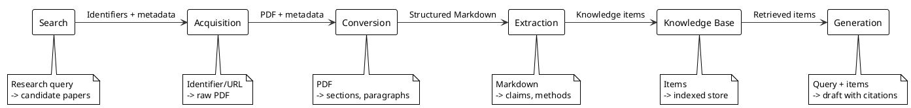

# Research Engine Architecture

## System Overview

We build a six-stage pipeline that transforms academic papers into a structured knowledge base and uses that knowledge to generate new documents. The pipeline begins with search: the researcher describes a topic, and the system queries academic APIs to find relevant papers. Search results feed into acquisition, which downloads PDFs. From there, papers flow through conversion, extraction, storage, and generation. Each stage reads from the local filesystem and writes back to it, producing artifacts in human-readable formats. The researcher runs any stage independently as a Cobra subcommand or composes multi-stage workflows through prompts or shell scripts.

The core insight is that research writing depends on structured knowledge, not raw text. By converting unstructured PDFs into typed knowledge items (claims, methods, definitions) with provenance links back to source passages, we make the gap between reading and writing a pipeline problem rather than a manual effort.

### Pipeline Lifecycle

A paper moves through six states, one per pipeline stage:

1. Searched: the paper appears as a candidate result from an academic API query, with identifier and metadata.
2. Acquired: the raw PDF exists on disk with metadata (source URL, DOI, title).
3. Converted: the PDF has been transformed into structured Markdown with section boundaries.
4. Extracted: knowledge items have been pulled from the structured text and linked to their source sections.
5. Stored: knowledge items reside in the knowledge base, indexed for retrieval.
6. Generated: a draft document exists that draws on stored knowledge items with citations.

Each state is visible as files on disk. A paper's progress through the pipeline is determined by which artifacts exist in the project directory. PRDs define the detailed state transitions and error conditions for each stage.

### Data Flow

Data flows forward through the pipeline. Each stage consumes the output of the previous stage and produces input for the next. The stages share no in-memory state; all communication happens through files on disk.

|  |
|:--:|



|Figure 1 Pipeline data flow from search through generation |

## Pipeline Interface

The pipeline operates on four data structures that flow between stages. We describe them here at the architecture level; PRDs specify the full field definitions and validation rules.

### Data Structures

Table 1 Pipeline Data Structures

| Structure | Role | Produced By | Consumed By |
|-----------|------|-------------|-------------|
| SearchResult | A candidate paper from an academic API query (identifier, title, authors, abstract, source, relevance score) | Search | Acquisition (as input identifiers) |
| Paper | Metadata and file paths for an acquired paper (URL, DOI, title, authors, PDF path) | Acquisition | Conversion, Extraction |
| KnowledgeItem | A typed extraction from a paper (claim, method, definition) with provenance (paper ID, section, page) | Extraction | Knowledge Base, Generation |
| Draft | A generated document section with inline citations linking claims to KnowledgeItems | Generation | Researcher (final output) |

### Operations per Stage

Table 2 Pipeline Operations

| Stage | Operation | Input | Output | Description |
|-------|-----------|-------|--------|-------------|
| Search | Search | Research query (free-text or structured) | List of SearchResults | Queries academic APIs, deduplicates, and ranks candidate papers |
| Acquisition | Acquire | URL, DOI, or file path | Paper record + PDF on disk | Downloads or copies the PDF and creates metadata |
| Conversion | Convert | Paper record | Structured Markdown file | Transforms PDF into sections, paragraphs, and figure references |
| Extraction | Extract | Structured Markdown | List of KnowledgeItems | Identifies claims, methods, and definitions with provenance |
| Knowledge Base | Store | KnowledgeItems | Indexed knowledge base | Persists items and builds retrieval index |
| Knowledge Base | Retrieve | Query string | Ranked KnowledgeItems | Returns items relevant to the query |
| Generation | Generate | Query + retrieved items | Draft Markdown with citations | Produces a document section grounded in specific items |

Each operation is a Cobra subcommand under `research-engine`. PRDs define the full signatures, preconditions, postconditions, and error handling for each operation.

## System Components

### Search

We query academic APIs to find papers relevant to a research question. The search component accepts free-text queries or structured parameters (author, keywords, date range), fans them out to multiple backends (arXiv API, Semantic Scholar API), deduplicates results across sources, and returns a ranked list of candidate papers. Each result carries an identifier that the acquisition stage can consume directly, along with title, authors, abstract, and a relevance score. The backend interface is extensible so we can add sources without modifying existing backend code.

See PRD: Paper Search for query interface, backend requirements, deduplication rules, and output format.

### Acquisition

We download papers from URLs, DOIs, or arXiv identifiers and store them locally. The acquisition component resolves identifiers to PDF download links, fetches the PDF, and creates a Paper metadata record. It handles arXiv abstract-to-PDF URL mapping, DOI resolution through content negotiation, and direct PDF URLs. When a paper already exists on disk, acquisition skips the download and returns the existing record.

See PRD: Paper Acquisition for identifier resolution rules, retry behavior, and metadata fields.

### Conversion

We transform PDF files into structured Markdown that preserves document organization. The conversion component extracts text from PDF pages, identifies section headings and paragraph boundaries, and produces a Markdown file with hierarchical structure. It handles multi-column layouts, inline equations, and figure captions. The output Markdown includes page-number annotations so downstream stages can link back to specific pages.

See PRD: PDF Conversion for supported PDF formats, section detection heuristics, and output schema.

### Extraction

We identify typed knowledge items within converted text. The extraction component reads structured Markdown and produces a list of KnowledgeItems, each categorized as a claim, method, definition, or result. Every item carries provenance: the paper ID, section heading, and page number where it appears. Extraction uses Generative AI to classify and summarize items while preserving the source language for verification.

See PRD: Knowledge Extraction for item types, provenance requirements, and extraction prompts.

### Knowledge Base

We store extracted knowledge items and make them retrievable by topic. The knowledge base component persists KnowledgeItems to local files (JSON or YAML) and maintains a retrieval index. A researcher queries the knowledge base with a topic or question and receives ranked items with their provenance. The storage format is human-readable and version-controllable.

See PRD: Knowledge Base for storage schema, indexing approach, and retrieval ranking.

### Generation

We produce draft document sections grounded in knowledge base content. The generation component takes a query or outline, retrieves relevant KnowledgeItems, and uses Generative AI to compose a draft paragraph or section. Every factual claim in the output includes an inline citation linking to the source KnowledgeItem and its originating paper. The researcher reviews and edits the draft; the system does not publish autonomously.

See PRD: Paper Generation for prompt structure, citation format, and output schema.

## Design Decisions

### Decision 1 File-Based Inter-Stage Communication

We pass data between pipeline stages through files on disk rather than in-memory channels or a database. Each stage reads input files and writes output files in well-defined formats (PDF, Markdown, JSON/YAML). This makes intermediate results inspectable, debuggable, and version-controllable. A researcher can examine or edit any artifact between stages.

Benefits: transparency, reproducibility, ability to re-run individual stages, compatibility with version control. The tradeoff is that file I/O adds latency, but for a personal tool processing tens of papers, throughput is not the bottleneck.

### Decision 2 Cobra CLI with Prompt-Based Composition

We expose each pipeline stage as a Cobra subcommand (`research-engine search`, `research-engine acquire`, `research-engine convert`, etc.) rather than using Mage targets for pipeline orchestration. The researcher composes multi-stage workflows through natural-language prompts or shell scripts rather than programmatic target chaining. Each subcommand is a self-contained operation that reads from disk and writes back to disk, so the researcher can invoke stages individually or string them together in any order.

Benefits: the CLI is the primary interface for both humans and agents, composition happens at the shell or prompt level where it is visible and editable, and each subcommand can evolve independently. Mage remains in the project for build automation, testing, and developer tooling, but it does not orchestrate pipeline stages. The alternative of Mage-based orchestration was rejected because it couples pipeline composition to build-tool conventions and hides the workflow from the researcher.

### Decision 3 Go Over Python

We implement the pipeline in Go rather than Python. Go produces static binaries that a researcher can install without managing virtual environments or dependency conflicts. Go's type system catches errors at compile time that Python would surface only at runtime. The research tooling ecosystem in Python is richer, but we invoke external tools (PDF converters, Generative AI APIs) through subprocesses and HTTP, so the implementation language matters less than the interfaces.

Benefits: static binaries, compile-time safety, single-binary distribution. The tradeoff is fewer research-focused libraries, which we mitigate by calling external tools.

### Decision 4 Local-First with Selective Internet Access

We store all data locally and require network access for three activities: search (to query academic APIs), acquisition (to download papers), and extraction/generation (to call Generative AI APIs). Conversion and storage run fully offline. The researcher owns their data and can inspect every file. We do not sync to cloud services.

Benefits: data ownership, privacy, offline operation for conversion and storage, version-controllable artifacts.

### Decision 5 Generative AI for Extraction and Generation

We use Generative AI (via API calls to Claude or similar models) for the extraction and generation stages rather than rule-based NLP. Research papers vary too widely in structure and language for hand-coded extraction rules to generalize. Generative AI handles the ambiguity of natural language while we enforce structure through typed output schemas.

Benefits: handles diverse paper formats, produces readable output. The risk of hallucination is mitigated by requiring provenance links and researcher review. See VISION.md Risks and Mitigations.

## Technology Choices

Table 3 Technology Choices

| Component | Technology | Purpose |
|-----------|-----------|---------|
| Implementation language | Go | Pipeline implementation, CLI, type safety |
| Build automation | Mage | Build automation, testing, developer tooling |
| Academic search | arXiv API, Semantic Scholar API | Query academic sources for candidate papers |
| PDF conversion | GROBID or pdftotext (external) | Transform PDF to structured text |
| Knowledge storage | JSON/YAML files | Human-readable, version-controllable item storage |
| Knowledge indexing | SQLite or in-memory | Retrieval index for knowledge items |
| Generative AI | Claude API (Anthropic) | Extraction classification and draft generation |
| CLI framework | Cobra | User-facing command-line interface |
| Configuration | Viper | CLI configuration and project settings |
| Testing | Go testing + testify | Unit and integration tests |

PRDs for each stage will specify the exact tool versions and configuration.

## Project Structure

```
research-engine/
  cmd/
    research-engine/       # CLI entry point and subcommands
      main.go
      search.go            # research-engine search subcommand
      acquire.go           # research-engine acquire subcommand
      convert.go           # research-engine convert subcommand
      extract.go           # research-engine extract subcommand
      knowledge.go         # research-engine knowledge subcommand
      generate.go          # research-engine generate subcommand
  internal/
    search/                # Search stage implementation
    acquire/               # Acquisition stage implementation
    convert/               # PDF conversion stage
    extract/               # Knowledge extraction stage
    knowledge/             # Knowledge base storage and retrieval
    generate/              # Draft generation stage
    pipeline/              # Pipeline orchestration (stage sequencing)
  pkg/
    types/                 # Shared types: Paper, KnowledgeItem, Draft
  magefiles/
    magefile.go            # Build automation, testing, developer tooling
  tests/
    integration/           # End-to-end pipeline tests
  docs/
    VISION.md
    ARCHITECTURE.md
    specs/
      product-requirements/
      use-cases/
      test-suites/
  papers/                  # Working directory for acquired papers (per-project)
  knowledge/               # Working directory for knowledge base (per-project)
  output/                  # Working directory for generated drafts (per-project)
```

Table 4 Package Roles

| Directory | Role |
|-----------|------|
| cmd/research-engine/ | CLI entry point and Cobra subcommands. Each pipeline stage is a subcommand. |
| internal/search/ | Queries academic APIs, deduplicates and ranks candidate papers. |
| internal/acquire/ | Downloads papers, resolves identifiers, creates Paper records. |
| internal/convert/ | Invokes PDF conversion tools, produces structured Markdown. |
| internal/extract/ | Calls Generative AI to classify and extract KnowledgeItems. |
| internal/knowledge/ | Persists KnowledgeItems, builds and queries the retrieval index. |
| internal/generate/ | Retrieves items, calls Generative AI, produces cited drafts. |
| internal/pipeline/ | Sequences stages, manages per-paper state progression. |
| pkg/types/ | Shared data structures: SearchResult, Paper, KnowledgeItem, Draft, Config. |
| magefiles/ | Build and developer tooling (build, test, lint, stats). No pipeline stage logic. |
| tests/integration/ | Tests that run multiple stages end-to-end. |

## Implementation Status

We are completing the Foundation phase. VISION.md is complete, ARCHITECTURE.md is updated for the six-stage pipeline, and PRDs exist for all six stages. Cobra CLI scaffolding is in place. No stage implementation code has been written yet.

Table 5 Implementation Phases

| Phase | Status | Notes |
|-------|--------|-------|
| Foundation | Nearing completion | VISION complete; ARCHITECTURE updated; PRDs for all six stages complete; Cobra CLI scaffolding in place |
| Core Pipeline | Not started | Search, Acquisition, and Conversion stages |
| Knowledge | Not started | Extraction and Knowledge Base |
| Generation | Not started | Draft generation with citations |

## Related Documents

Table 6 Related Documents

| Document | Role |
|----------|------|
| VISION.md | Project purpose, success criteria, and boundaries |
| PRD: Paper Search | Requirements for querying academic APIs and ranking results |
| PRD: Paper Acquisition | Requirements for downloading and resolving papers |
| PRD: PDF Conversion | Requirements for transforming PDFs to structured text |
| PRD: Knowledge Extraction | Requirements for identifying typed knowledge items |
| PRD: Knowledge Base | Requirements for storage, indexing, and retrieval |
| PRD: Paper Generation | Requirements for draft generation with citations |

## References

See VISION.md for goals, success criteria, and explicit boundaries. See PRDs in docs/specs/product-requirements/ for detailed requirements per stage.
