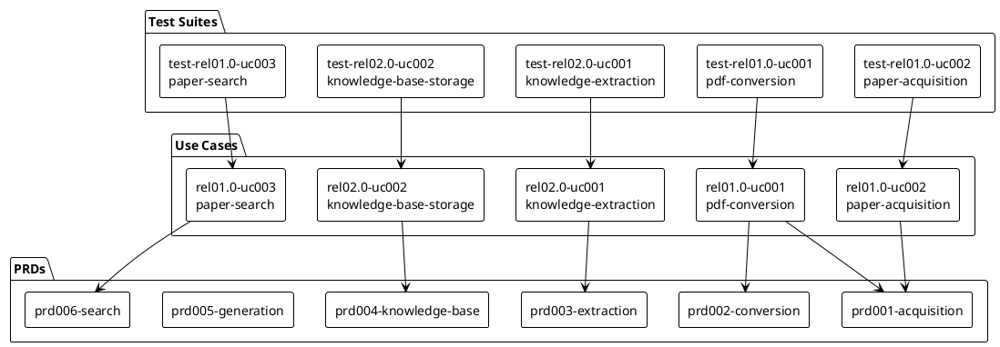

<!-- Copyright Mesh Intelligence Inc., 2026. All rights reserved. -->

# Specifications

## Overview

We build a six-stage research pipeline that takes academic papers from search through knowledge extraction to cited draft generation. This document ties together the project's PRDs, use cases, test suites, and roadmap into one navigable page. It summarizes each artifact and shows how they relate so a reader can understand what we are building, in what order, and where the details live.

See [VISION.md](VISION.md) for project goals, success criteria, and boundaries. See [ARCHITECTURE.md](ARCHITECTURE.md) for system components, data flow, and design decisions.

## Roadmap Summary

We organize work into releases that correspond to pipeline phases. Each release delivers a set of use cases that exercise one or more PRDs.

Table 1 Roadmap Summary

| Release | Name | Use Cases (done / total) | Status |
|---------|------|--------------------------|--------|
| 01.0 | Core Pipeline | 3 / 3 | done |
| 02.0 | Knowledge | 0 / 2 | not started |
| 03.0 | Generation | 0 / 1 | not started |

## PRD Index

Table 2 PRD Index

| PRD | Title | Summary |
|-----|-------|---------|
| [prd001-acquisition](specs/product-requirements/prd001-acquisition.yaml) | Paper Acquisition | Defines how the system resolves arXiv IDs, DOIs, and direct URLs to downloadable PDFs, stores them locally, and records provenance metadata |
| [prd002-conversion](specs/product-requirements/prd002-conversion.yaml) | PDF to Markdown Conversion | Defines how the system transforms PDFs into structured Markdown with section headings, paragraph boundaries, and page markers using container-based backends |
| [prd003-extraction](specs/product-requirements/prd003-extraction.yaml) | Knowledge Extraction | Defines how the system extracts typed knowledge items (claims, methods, definitions, results) from structured Markdown using Generative AI with provenance tracking |
| [prd004-knowledge-base](specs/product-requirements/prd004-knowledge-base.yaml) | Knowledge Base | Defines how the system stores knowledge items in SQLite with FTS5 indexing and supports full-text search, structured queries, provenance tracing, and export |
| [prd005-generation](specs/product-requirements/prd005-generation.yaml) | Paper Generation | Defines how the system generates cited draft sections from knowledge base content using Generative AI with inline citations and source traceability |
| [prd006-search](specs/product-requirements/prd006-search.yaml) | Paper Search | Defines how the system queries arXiv and Semantic Scholar, deduplicates results, and presents ranked candidate papers with acquisition-ready identifiers |

## Use Case Index

Table 3 Use Case Index

| Use Case | Title | Release | Status | Test Suite |
|----------|-------|---------|--------|------------|
| [rel01.0-uc001-pdf-conversion](specs/use-cases/rel01.0-uc001-pdf-conversion.yaml) | PDF to Structured Markdown Conversion | 01.0 | done | [test-rel01.0-uc001-pdf-conversion](specs/test-suites/test-rel01.0-uc001-pdf-conversion.yaml) |
| [rel01.0-uc002-paper-acquisition](specs/use-cases/rel01.0-uc002-paper-acquisition.yaml) | Paper Acquisition by Identifier | 01.0 | done | [test-rel01.0-uc002-paper-acquisition](specs/test-suites/test-rel01.0-uc002-paper-acquisition.yaml) |
| [rel01.0-uc003-paper-search](specs/use-cases/rel01.0-uc003-paper-search.yaml) | Academic Paper Search | 01.0 | done | [test-rel01.0-uc003-paper-search](specs/test-suites/test-rel01.0-uc003-paper-search.yaml) |
| [rel02.0-uc001-knowledge-extraction](specs/use-cases/rel02.0-uc001-knowledge-extraction.yaml) | Knowledge Extraction from Structured Markdown | 02.0 | spec_complete | [test-rel02.0-uc001-knowledge-extraction](specs/test-suites/test-rel02.0-uc001-knowledge-extraction.yaml) |
| [rel02.0-uc002-knowledge-base-storage](specs/use-cases/rel02.0-uc002-knowledge-base-storage.yaml) | Knowledge Base Storage and Retrieval | 02.0 | spec_complete | [test-rel02.0-uc002-knowledge-base-storage](specs/test-suites/test-rel02.0-uc002-knowledge-base-storage.yaml) |

## Test Suite Index

Table 4 Test Suite Index

| Test Suite | Title | Traces | Test Cases |
|------------|-------|--------|------------|
| [test-rel01.0-uc001-pdf-conversion](specs/test-suites/test-rel01.0-uc001-pdf-conversion.yaml) | PDF to Structured Markdown Conversion | rel01.0-uc001-pdf-conversion, prd002-conversion | 16 |
| [test-rel01.0-uc002-paper-acquisition](specs/test-suites/test-rel01.0-uc002-paper-acquisition.yaml) | Paper Acquisition by Identifier | rel01.0-uc002-paper-acquisition, prd001-acquisition | 14 |
| [test-rel01.0-uc003-paper-search](specs/test-suites/test-rel01.0-uc003-paper-search.yaml) | Academic Paper Search | rel01.0-uc003-paper-search, prd006-search | 16 |
| [test-rel02.0-uc001-knowledge-extraction](specs/test-suites/test-rel02.0-uc001-knowledge-extraction.yaml) | Knowledge Extraction from Structured Markdown | rel02.0-uc001-knowledge-extraction, prd003-extraction | 18 |
| [test-rel02.0-uc002-knowledge-base-storage](specs/test-suites/test-rel02.0-uc002-knowledge-base-storage.yaml) | Knowledge Base Storage and Retrieval | rel02.0-uc002-knowledge-base-storage, prd004-knowledge-base | 26 |

## PRD-to-Use-Case Mapping

We derive this mapping from each use case's touchpoints field. Each row shows which PRD a use case exercises, why that PRD is required, and how much of the PRD the use case covers.

Table 5 PRD-to-Use-Case Mapping

| Use Case | PRD | Why Required | Coverage |
|----------|-----|--------------|----------|
| [rel01.0-uc001-pdf-conversion](specs/use-cases/rel01.0-uc001-pdf-conversion.yaml) | [prd002-conversion](specs/product-requirements/prd002-conversion.yaml) | Validates the full conversion flow: backend detection, PDF-to-Markdown transformation, post-processing, and batch reporting | Full (R1-R6) |
| [rel01.0-uc001-pdf-conversion](specs/use-cases/rel01.0-uc001-pdf-conversion.yaml) | [prd001-acquisition](specs/product-requirements/prd001-acquisition.yaml) | Reads Paper metadata records from papers/metadata/ produced by acquisition | Partial (R3 only) |
| [rel01.0-uc002-paper-acquisition](specs/use-cases/rel01.0-uc002-paper-acquisition.yaml) | [prd001-acquisition](specs/product-requirements/prd001-acquisition.yaml) | Validates identifier resolution, PDF download, metadata extraction, idempotency, and batch processing | Full (R1-R5) |
| [rel01.0-uc003-paper-search](specs/use-cases/rel01.0-uc003-paper-search.yaml) | [prd006-search](specs/product-requirements/prd006-search.yaml) | Validates query interface, arXiv and Semantic Scholar backends, deduplication, ranking, and output formats | Full (R1-R5) |
| [rel02.0-uc001-knowledge-extraction](specs/use-cases/rel02.0-uc001-knowledge-extraction.yaml) | [prd003-extraction](specs/product-requirements/prd003-extraction.yaml) | Validates item type classification, provenance tracking, citation parsing, tagging, incremental processing, and API interaction | Full (R1-R6) |
| [rel02.0-uc002-knowledge-base-storage](specs/use-cases/rel02.0-uc002-knowledge-base-storage.yaml) | [prd004-knowledge-base](specs/product-requirements/prd004-knowledge-base.yaml) | Validates SQLite storage, FTS5 indexing, full-text search, structured queries, provenance tracing, incremental updates, and export | Full (R1-R6) |

## Traceability Diagram

|  |
|:--:|

|Figure 1 Traceability between PRDs, use cases, and test suites |

## Coverage Gaps

We identify the following gaps in the current specification coverage:

- prd005-generation has no use case. Release 03.0 lists rel03.0-uc001-draft-generation in the roadmap but the use case YAML file does not yet exist and no test suite covers it.
- prd003-extraction is exercised by rel02.0-uc001 but the extraction YAML also references the Paper metadata from prd001-acquisition (for provenance fields); this indirect dependency is not expressed as a separate use case touchpoint for prd001.
- prd004-knowledge-base R4.2-R4.3 (trace operation reading from papers/markdown/) depends on conversion artifacts from prd002-conversion, but no cross-release use case validates this end-to-end path.
- rel03.0-uc001-draft-generation is listed in road-map.yaml with status not_started but has no corresponding use case YAML file or test suite yet.
